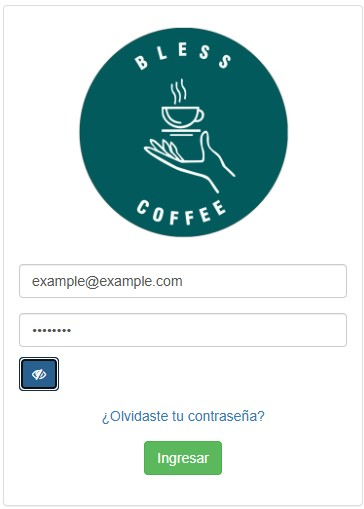
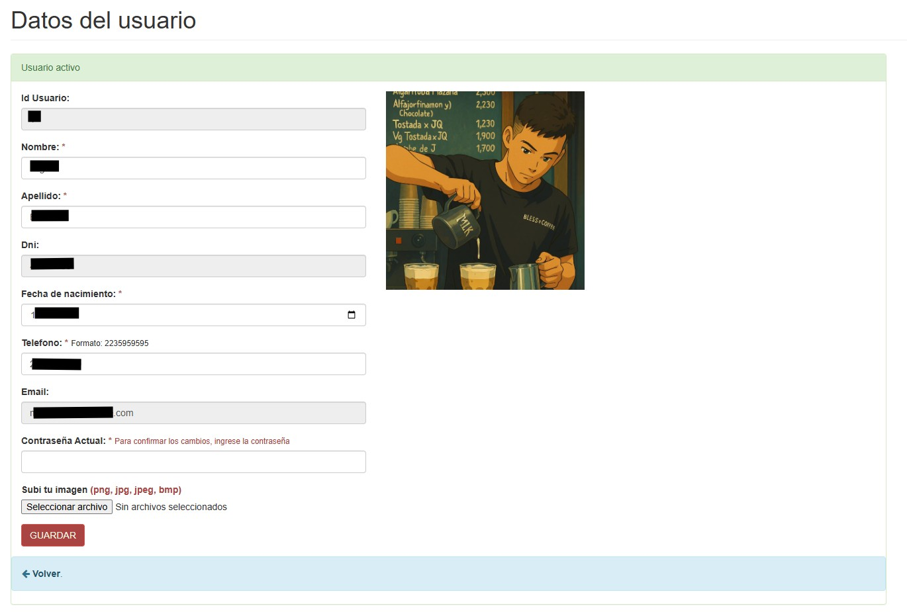
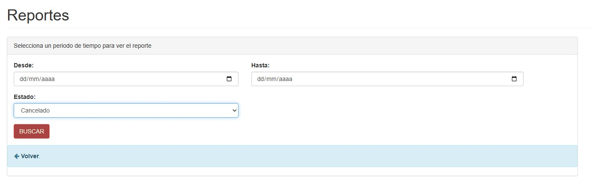
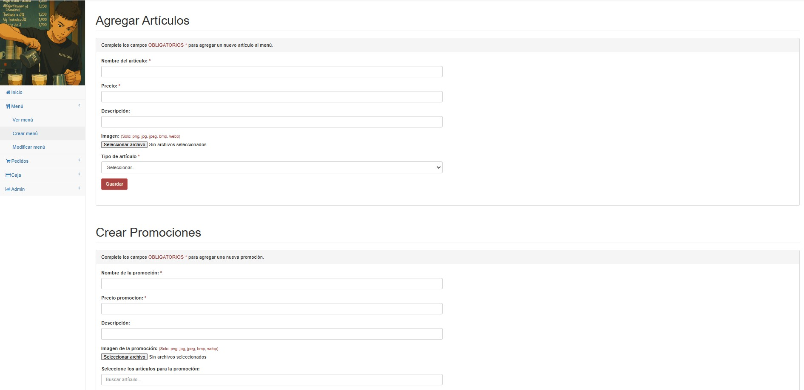
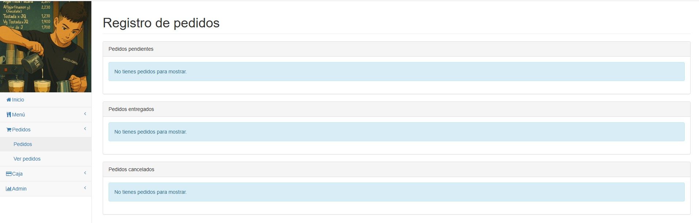

# BlessCoffee ☕

Internal management web application developed for the coffee shop **Bless Coffee**.

This system allows you to manage orders, manage the menu, generate sales reports, and keep accounting records, all from an intuitive web platform.

---

## 🚀 Technologies used

* **Backend:** PHP
* **Frontend:** HTML, CSS, JavaScript, Bootstrap
* **Database:** MySQL

---

## 🔑 Main features

✅ Real-time order generation and management.
✅ Complete menu management (additions, deletions, modifications).
✅ Automatic sales reports by period.
✅ Accounting functions for internal control.
✅ Differentiated dashboards by user type (administrator, employee).
✅ User and permission management.

---

## 📸 Screenshots
---
| Description | Image |
| ---------------------- | --------------------------------------- |
| Login |  |
| User Data |  |
| Reports |  |
| Add new item / promotion |  |
| Order Registration |  |

---
## 📄 Nota legal

BlessCoffee is a system developed exclusively for commercial use by Bless Coffee.
All code, design, and logic of the system are protected by copyright.
Copying, redistribution, or reuse without the express permission of the author is prohibited.

© 2025 Lucas Bonadies

